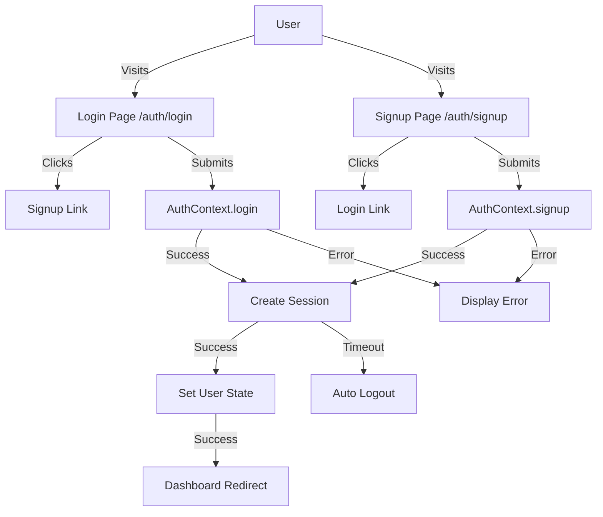
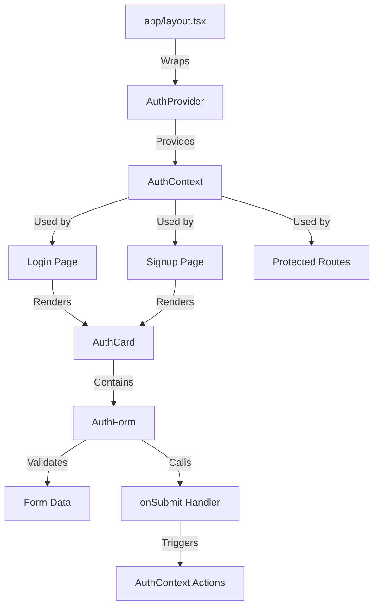

# Authentication System Documentation

## Overview

The authentication system provides a complete, production-ready solution for user authentication in Next.js applications. Built with React Context API and TypeScript, it offers login and signup functionality with comprehensive validation, responsive design, and session-based state management.

### Key Features
- **Type-Safe**: Full TypeScript implementation with compile-time error checking
- **Responsive**: Mobile-first design with consistent experience across devices
- **Accessible**: ARIA attributes, keyboard navigation, and screen reader support
- **Secure**: Session-based authentication with automatic timeout handling
- **Extensible**: Modular architecture ready for backend integration and social login
- **Theme-Aware**: Automatic dark mode support through CSS variables
- **Session Management**: Automatic session timeout (30 minutes) with activity-based extension
- **Professional**: Clean code practices with proper error handling and state management

## Authentication Flow



## Component Hierarchy



## State Management

The authentication state is managed through React Context API with professional session management:

### AuthContext Interface
```typescript
interface AuthContextType {
  user: User | null;
  isAuthenticated: boolean;
  isLoading: boolean;
  error: string | null;
  login: (email: string, password: string) => Promise<void>;
  signup: (name: string, email: string, password: string) => Promise<void>;
  logout: () => void;
}
```

### User Type
```typescript
type User = {
  id: string;
  name: string;
  email: string;
};
```

### State Access Patterns
```typescript
// Full context access
const { user, isAuthenticated, login, logout } = useAuth();

// Actions only
const { login, signup, logout, isLoading, error } = useAuthActions();

// State only
const { user, isAuthenticated, isLoading, error } = useAuthState();
```

## Session Management

The authentication system includes professional session management with automatic timeout handling:

### Session Manager Service
```typescript
// Create session for authenticated user
createSession(user: User): void

// Get current session data if valid
getSession(): User | null

// Update activity to extend session
updateActivity(): void

// Clear current session
clearSession(): void

// Check if session is active and valid
isSessionValid(): boolean

// Get time remaining in session (milliseconds)
getTimeRemaining(): number
```

### Session Features
- **Automatic Timeout**: Sessions expire after 30 minutes of inactivity
- **Activity Tracking**: User activity extends session automatically
- **Auto Logout**: Automatic logout when session expires
- **Memory-Based**: No localStorage dependencies for better security
- **Professional Cleanup**: Proper session cleanup on logout or timeout
- **Error Handling**: Comprehensive error handling for session operations

### Session Timeout Handling
- **30-Minute Timeout**: Sessions automatically expire after 30 minutes
- **Activity Extension**: Any user activity resets the timeout counter
- **Auto Logout**: Users are automatically logged out when session expires
- **Error Messages**: Clear feedback when session expires

## Component Usage

### AuthCard Component
Wrapper component providing consistent card layout for authentication forms.

```tsx
import { AuthCard } from "@/app/auth/components/AuthCard"

// Basic usage
<AuthCard>
  <p>Authentication content</p>
</AuthCard>

// With title and description
<AuthCard 
  title="Welcome Back"
  description="Sign in to your account to continue"
>
  <AuthForm type="login" onSubmit={handleLogin} />
</AuthCard>
```

**Props:**
- `children` (required): React.ReactNode
- `title` (optional): string
- `description` (optional): string
- `className` (optional): string

### AuthForm Component
Complete authentication form with built-in validation and state management.

```tsx
import { AuthForm } from "@/app/auth/components/AuthForm"

// Login form
<AuthForm 
  type="login" 
  onSubmit={async (email, password) => {
    await signIn(email, password)
  }} 
/>

// Signup form
<AuthForm 
  type="signup" 
  onSubmit={async (email, password, name) => {
    await createAccount(name, email, password)
  }} 
/>
```

**Props:**
- `type` (required): 'login' | 'signup'
- `onSubmit` (required): (email: string, password: string, name?: string) => void
- `className` (optional): string

**Validation Rules:**
- **Email**: Required, valid format (user@domain.com)
- **Password**: Required, minimum 6 characters
- **Name**: Required for signup, minimum 2 characters
- **Confirm Password**: Required for signup, must match password

## Usage Examples

### Basic Authentication Check
```typescript
import { useAuth } from '@/app/auth/hooks/useAuth';

function MyComponent() {
  const { isAuthenticated, user } = useAuth();
  
  if (!isAuthenticated) {
    return <div>Please log in</div>;
  }
  
  return <div>Welcome, {user.name}!</div>;
}
```

### Protected Route Pattern
```typescript
import { useAuth } from '@/app/auth/hooks/useAuth';
import { redirect } from 'next/navigation';

function ProtectedPage() {
  const { isAuthenticated, isLoading } = useAuth();
  
  if (isLoading) {
    return <div>Loading...</div>;
  }
  
  if (!isAuthenticated) {
    redirect('/login');
  }
  
  return <div>Protected content</div>;
}
```

### Complete Authentication Page
```tsx
import { AuthCard } from "@/app/auth/components/AuthCard"
import { AuthForm } from "@/app/auth/components/AuthForm"

export default function LoginPage() {
  const handleLogin = async (email: string, password: string) => {
    try {
      await authenticateUser(email, password)
      router.push("/dashboard")
    } catch (error) {
      console.error("Login failed:", error)
    }
  }

  return (
    <div className="min-h-screen flex items-center justify-center bg-background">
      <AuthCard 
        title="Welcome Back"
        description="Sign in to your account to continue"
      >
        <AuthForm 
          type="login" 
          onSubmit={handleLogin}
        />
      </AuthCard>
    </div>
  )
}
```

## Integration

The AuthProvider is integrated into the root layout to ensure authentication state is available throughout the application:

```typescript
// app/layout.tsx
import { AuthProvider } from '@/app/auth/context/AuthContext';

export default function RootLayout({ children }) {
  return (
    <AuthProvider>
      {children}
    </AuthProvider>
  );
}
```

## Error Handling

The system includes comprehensive error handling:

### Validation Errors
- Real-time form validation with inline error messages
- Email format validation
- Password strength requirements
- Field presence validation
- Password confirmation matching

### Authentication Errors
- Invalid credentials
- User not found
- User already exists (signup)
- Network errors (simulated)
- Session timeout errors

### Session Errors
- Session expiration handling
- Automatic logout on timeout
- Clear error messages for expired sessions
- Graceful session cleanup

### User Feedback
- Loading states during submission
- Error alerts displayed above forms
- Success notifications (alerts for demo, replace with toast in production)
- Session timeout warnings

## Security Considerations

### Current Implementation
- **Session-Based**: No localStorage dependencies for better security
- **Automatic Timeout**: Sessions expire after 30 minutes of inactivity
- **Activity Tracking**: User activity extends session automatically
- **Clean State Management**: Professional state cleanup on logout
- **Type Safety**: Full TypeScript implementation prevents runtime errors

### Session Security
- **Memory-Based Storage**: No persistent storage of sensitive data
- **Automatic Cleanup**: Sessions are properly cleaned up on timeout or logout
- **Activity Monitoring**: User activity automatically extends valid sessions
- **Professional Error Handling**: Secure error handling without exposing sensitive information

### Production Recommendations
- Implement password hashing (bcrypt, Argon2)
- Add server-side validation
- Implement rate limiting for login attempts
- Add CAPTCHA for signup form
- Use HTTPS for all authentication requests
- Implement proper JWT token management
- Add email verification workflow
- Implement password reset functionality
- Add CSRF protection for authentication requests
- Consider implementing refresh tokens for extended sessions
- Add audit logging for authentication events

## Future Enhancements

### Authentication Features
- Social login providers (Google, GitHub, Facebook)
- Multi-factor authentication (MFA)
- Remember me functionality with secure tokens
- Enhanced session timeout handling with warnings
- Account lockout after failed attempts
- Advanced session management with refresh tokens

### UI/UX Improvements
- Loading spinners instead of text
- Toast notifications for success/error messages
- Password strength indicator
- Terms of service and privacy policy links
- Email verification UI
- Password reset forms
- Session timeout warnings with countdown

### Technical Enhancements
- Backend API integration
- Database integration for user storage
- Email service integration
- Rate limiting implementation
- Security audit and penetration testing
- Comprehensive test suite (unit, integration, e2e)

### Accessibility
- Enhanced screen reader support
- High contrast mode support
- Keyboard-only navigation optimization
- Focus management improvements

## Best Practices

1. **Always use hooks**: Use `useAuth()` or its convenience variants instead of accessing context directly
2. **Handle loading states**: Always check `isLoading` before rendering content
3. **Error handling**: Display error messages to users appropriately
4. **Type safety**: Leverage TypeScript for compile-time error checking
5. **Clean separation**: Keep authentication logic separate from UI components
6. **Test thoroughly**: Test both light and dark modes, different screen sizes, and error scenarios
7. **Security first**: Never expose sensitive data in client-side code
8. **Progressive enhancement**: Build for basic functionality first, then add enhancements
9. **Session awareness**: Be mindful of session timeouts in long-running applications
10. **Professional cleanup**: Always clean up sessions properly on logout

## Migration Guide

### From LocalStorage-Based Authentication
This session-based implementation replaces the previous localStorage-dependent system with:
- **Removed localStorage dependencies**: No more browser storage requirements
- **Professional session management**: Automatic timeout and cleanup
- **Enhanced security**: Memory-based sessions with proper cleanup
- **Better user experience**: No storage warnings or persistence issues
- **Cleaner architecture**: Simplified state management without storage complexity

### Migration Steps
1. Remove all localStorage-related code from your authentication system
2. Implement session-based state management using the provided SessionManager
3. Update all authentication components to use the new session-based hooks
4. Remove any localStorage warning components
5. Update documentation to reflect the new session-based approach
6. Test the complete authentication flow with session timeouts

All information from previous documentation has been consolidated and enhanced with additional examples, diagrams, and best practices for the new session-based system.